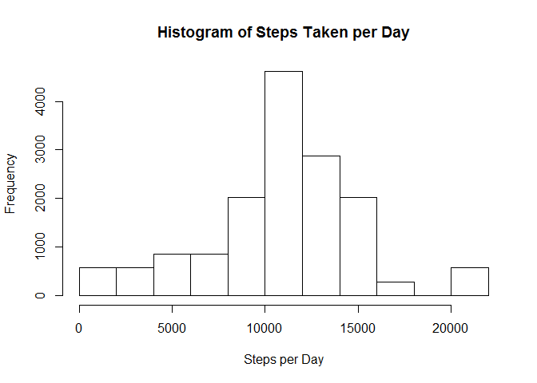
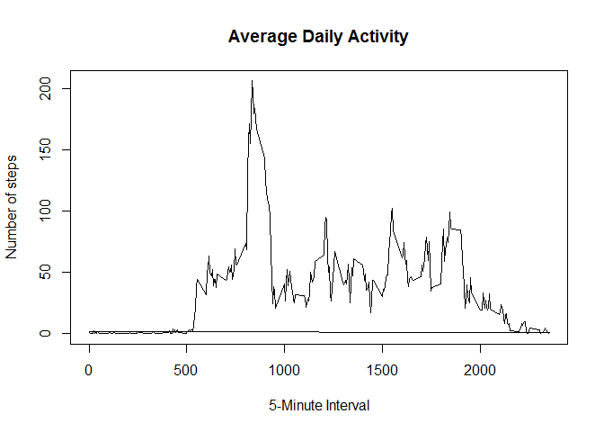
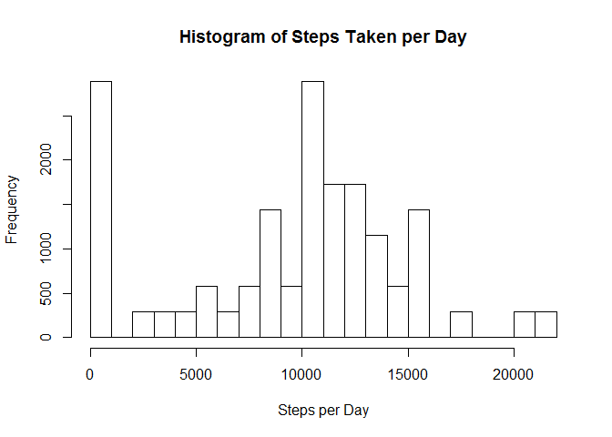
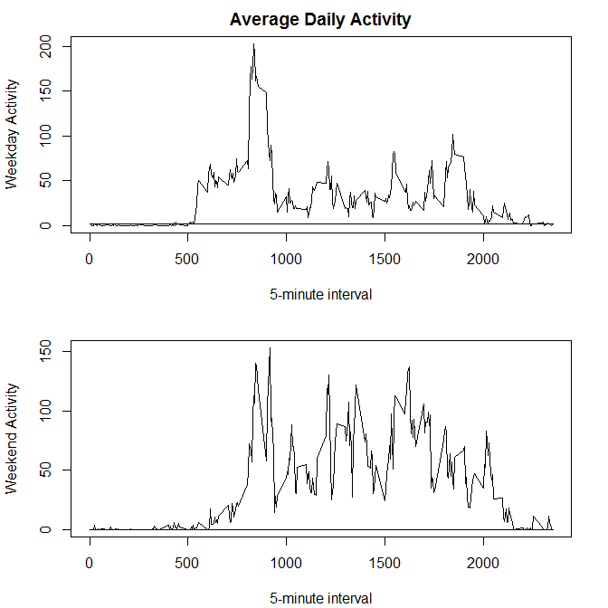

# Reproducible Research: Peer Assessment 1

## Loading and preprocessing the data
1. Load the data (i.e., read.csv())

```r
data <- read.csv("activity.csv")
```

2. Process/transform the data (if necessary) into a format suitable for your analysis

```r
data.part <- data
```


## What is mean total number of steps taken per day?
1. Calculate the total number of steps taken per day

2. Make a histogram of the total number of steps taken each day.

```r
for (i in levels(data$date)) {
    idx <- !is.na(data$steps) & (data$date == i)
    data$total.steps[idx] <- sum(data$steps[idx], na.rm = TRUE)
}
hist(data$total.steps, xlab="Steps per Day", main="Histogram of Steps Taken per Day")
```

 

3. Calculate and report the mean and median of the total number of steps taken per day.

```r
mean(data$total.steps, na.rm=TRUE)
```

```
## [1] 10766.19
```

```r
median(data$total.steps, na.rm=TRUE)
```

```
## [1] 10765
```


## What is the average daily activity pattern?
1. Make a time series plot (i.e., type = "l") of the 5-minute interval (x-axis) and the average number of steps taken, averaged across all days (y-axis)

```r
for (i in levels(as.factor(data$interval))) {
    idx <- !is.na(data$steps) & (data$interval == i)
    data$daily.activity[idx] <- mean(data$steps[idx])
}

plot(data$interval, data$daily.activity, type="l",
     xlab="5-Minute Interval",
     ylab="Number of steps",
     main="Average Daily Activity")
```

 

2. Which 5-minute interval, on average across all the days in the dataset, contains the maximum number of steps?

```r
data$interval[which.max(data$daily.activity)]
```

```
## [1] 835
```


## Imputing missing values
1. Calculate and report the total number of missing values in the dataset (i.e., the total number of rows with NA's)

```r
present.count <- sum(complete.cases(data[,1:3]))
na.count <- length(data$date) - present.count
print(na.count)
```

```
## [1] 2304
```

2. Devise a strategy for filling in all of the missing values in the dataset. The strategy does not need to be sophisticated. For example, you could use the mean/median for that day, or the mean for that 5-minute interval, etc.

This analysis uses mean steps for each day to fill in missing values.

3. Create a new dataset that is equal to the original dataset but with the missing data filled in.

```r
data.full <- data.part

for (i in levels(data.full$date)) {
    idx <- complete.cases(data.full[,1:3]) & (data.full$date == i)
    mean.val <- mean(data.full$steps[idx], na.rm=TRUE)
    if(is.nan(mean.val)) {
        mean.val <- 0
    }
    idx <- !complete.cases(data.full[,1:3]) & (data.full$date == i)
    data.full$steps[idx] <- mean.val
}
```

4. Make a histogram of the total number of steps taken each day and Calculate and report the mean and median total number of steps taken per day.

```r
for (i in levels(data.full$date)) {
    idx <- (data.full$date == i)
    data.full$total.steps[idx] <- sum(data.full$steps[idx])
}
hist(data.full$total.steps, xlab="Steps per Day", main="Histogram of Steps Taken per Day")
```

 


```r
mean(data.full$total.steps, na.rm=TRUE)
```

```
## [1] 9354.23
```

```r
median(data.full$total.steps, na.rm=TRUE)
```

```
## [1] 10395
```

Do these values differ from the estimates from the first part of the assignment?

The mean reduced by 13%. This effect is significant. The median reduced by 3%. The reduction in the median is not very significant.

What is the impact of imputing missing data on the estimates of the total daily number of steps?

Imputing missing data on the total daily number of steps would normally significantly remove bias. However, in this case, there are enough days that have no data that 13% of the data points are assigned a value of zero steps. This effect biases the mean more than if those days had been ignored. The effect on the median is small.

## Are there differences in activity patterns between weekdays and weekends?

1. Create a new factor variable in the dataset with two levels - "weekday" and "weekend" indicating whether a given date is a weekday or weekend day.

```r
days.in.week <- c("Monday", "Tuesday", "Wednesday", "Thursday", "Friday")
data.full$is.weekday <- factor((weekdays(as.Date(as.character(data$date), format="%Y-%m-%d"))
                                 %in% days.in.week),
                               levels=c(FALSE, TRUE),
                               labels=c("weekend", "weekday"))
```

2. Make a panel plot containing a time series plot (i.e., type = "l") of the 5-minute interval (x-axis) and the average number of steps taken, averaged across all weekday days or weekend days (y-axis). See the README file in the GitHub repository to see an example of what this plot should look like using simulated data.

```r
idx.weekday <- as.character(data.full$is.weekday) == "weekday"
idx.weekend <- as.character(data.full$is.weekday) == "weekend"
for(i in levels(as.factor(data.full$interval))) {
    idx <- (data.full$interval == i) & (idx.weekday)
    data.full$weekday.activity[idx] <- mean(data.full$steps[idx])
    
    idx <- (data.full$interval == i) & (idx.weekend)
    data.full$weekend.activity[idx] <- mean(data.full$steps[idx])
}

par(mfrow=c(2,1), mar=c(4.1, 4.1, 2.1, 2.1))

plot(data.full$interval[idx.weekday], data.full$weekday.activity[idx.weekday],
     type="l",
     xlab="5-minute interval",
     ylab="Weekday Activity",
     main="Average Daily Activity")
plot(data.full$interval[idx.weekend], data.full$weekend.activity[idx.weekend],
     type="l",
     xlab="5-minute interval",
     ylab="Weekend Activity",
     main="")
```

 
