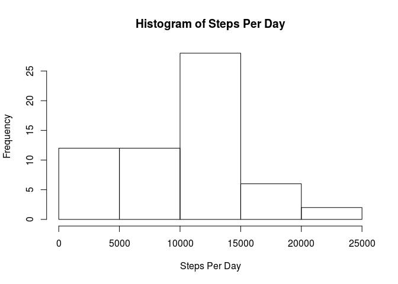

# Reproducible Research: Peer Assessment 1

## Loading and preprocessing the data
1. Load the data (i.e., read.csv())

```r
data <- read.csv("activity.csv")
```

2. Process/transform the data (if necessary) into a format suitable for your analysis

```r
data.part <- data
```

## What is mean total number of steps taken per day?
1. Calculate the total number of steps taken per day

2. Make a histogram of the total number of steps taken each day.


```r
suppressMessages(library(dplyr))
data.c1 <- data %>%
               group_by(date) %>%
               summarise(tot.steps=sum(steps))
hist(data.c1$tot.steps,
     xlab="Total Steps Per Day",
     main="Histogram of Total Steps Per Day")
```

 

3. Calculate and report the mean and median of the total number of steps taken per day.


```r
mean(data.c1$tot.steps, na.rm=TRUE)
```

```
## [1] 10766.19
```

```r
median(data.c1$tot.steps, na.rm=TRUE)
```

```
## [1] 10765
```


## What is the average daily activity pattern?
1. Make a time series plot (i.e., type = "l") of the 5-minute interval (x-axis) and the average number of steps taken, averaged across all days (y-axis)


```r
data.c2 <- data %>%
             group_by(interval) %>%
             summarise(mean.steps = mean(steps, na.rm=TRUE))
plot(data.c2$interval, data.c2$mean.steps,
     type="l",
     xlab="5-Minute Interval",
     ylab="Mean Steps",
     main="Mean Steps Taken Each Interval Across All Days")
```

 

2. Which 5-minute interval, on average across all the days in the dataset, contains the maximum number of steps?


```r
data.c2$interval[which.max(data.c2$mean.steps)]
```

```
## [1] 835
```


## Imputing missing values
1. Calculate and report the total number of missing values in the dataset (i.e., the total number of rows with NA's)

```r
present.count <- sum(complete.cases(data[,1:3]))
na.count <- length(data$date) - present.count
print(na.count)
```

```
## [1] 2304
```

2. Devise a strategy for filling in all of the missing values in the dataset. The strategy does not need to be sophisticated. For example, you could use the mean/median for that day, or the mean for that 5-minute interval, etc.

This analysis uses mean steps for each day to fill in missing values.

3. Create a new dataset that is equal to the original dataset but with the missing data filled in.

```r
data.full <- data.part

for (i in levels(data.full$date)) {
    idx <- complete.cases(data.full[,1:3]) & (data.full$date == i)
    mean.val <- mean(data.full$steps[idx], na.rm=TRUE)
    if(is.nan(mean.val)) {
        mean.val <- 0
    }
    idx <- !complete.cases(data.full[,1:3]) & (data.full$date == i)
    data.full$steps[idx] <- mean.val
}
```

4. Make a histogram of the total number of steps taken each day and Calculate and report the mean and median total number of steps taken per day.


```r
data.full.c1 <- data.full %>%
                    group_by(date) %>%
                    summarise(tot.steps=sum(steps, rm.na=TRUE))
hist(data.full.c1$tot.steps,
     xlab="Steps Per Day",
     main="Histogram of Steps Per Day")
```

 

Imputing missing values introduces a small bias in this data set, since there are entire days that have missing steps data. Here I plot the histogram of total number of steps taken each day by ignoring days that have no data.

```r
data.full.c2 <- data.full %>%
                    group_by(date) %>%
                    summarise(tot.steps=sum(steps, rm.na=FALSE))
for (i in seq(1:length(data.full.c2))) {
    if(data.full.c2$tot.steps[i] == 0) {
        data.full.c2$tot.steps[i] = NA
    }
}
hist(data.full.c2$tot.steps,
     xlab="Steps Per Day",
     main="Histogram of Steps Per Day")
```

 


```r
mean(data.full.c1$tot.steps, na.rm=TRUE)
```

```
## [1] 9355.23
```

```r
median(data.full.c1$tot.steps, na.rm=TRUE)
```

```
## [1] 10396
```


```r
mean(data.full.c2$tot.steps, na.rm=TRUE)
```

```
## [1] 9510.133
```

```r
median(data.full.c2$tot.steps, na.rm=TRUE)
```

```
## [1] 10417
```

Do these values differ from the estimates from the first part of the assignment?

The mean reduced by 13%. This effect is significant. The median reduced by 3%. The effect of the change in median is smaller than that of the mean, but still significant.

What is the impact of imputing missing data on the estimates of the total daily number of steps?

Imputing missing data removes bias. In this case, there is a small amount of additional bias introduced by days that are completely missing. This effect is small (less than 2%) but significant.

## Are there differences in activity patterns between weekdays and weekends?

1. Create a new factor variable in the dataset with two levels - "weekday" and "weekend" indicating whether a given date is a weekday or weekend day.

```r
days.in.week <- c("Monday", "Tuesday", "Wednesday", "Thursday", "Friday")
data.full$is.weekday <- factor((weekdays(as.Date(as.character(data$date), format="%Y-%m-%d"))
                                 %in% days.in.week),
                               levels=c(FALSE, TRUE),
                               labels=c("weekend", "weekday"))
```

2. Make a panel plot containing a time series plot (i.e., type = "l") of the 5-minute interval (x-axis) and the average number of steps taken, averaged across all weekday days or weekend days (y-axis). See the README file in the GitHub repository to see an example of what this plot should look like using simulated data.


```r
idx.weekday <- as.character(data.full$is.weekday) == "weekday"
idx.weekend <- as.character(data.full$is.weekday) == "weekend"

data.full.c3 <- data.full[idx.weekday,] %>%
                    group_by(interval) %>%
                    summarise(weekday.activity=mean(steps))
data.full.c4 <- data.full[idx.weekend,] %>%
                    group_by(interval) %>%
                    summarise(weekend.activity=mean(steps))

par(mfrow=c(2,1), mar=c(4.1, 4.1, 2.1, 2.1))

plot(data.full.c3$interval, data.full.c3$weekday.activity,
     type="l",
     xlab="5-minute interval",
     ylab="Weekday Activity",
     main="Average Daily Activity")
plot(data.full.c4$interval, data.full.c4$weekend.activity,
     type="l",
     xlab="5-minute interval",
     ylab="Weekend Activity",
     main="")
```

 
